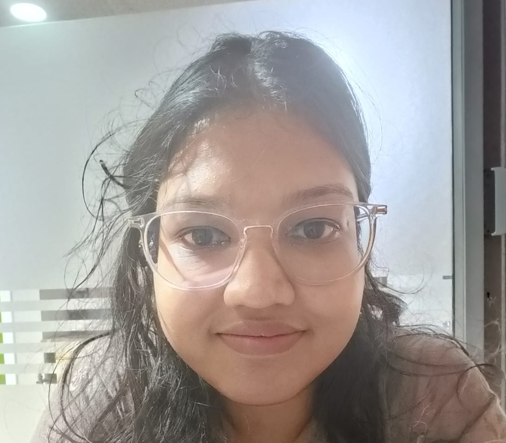
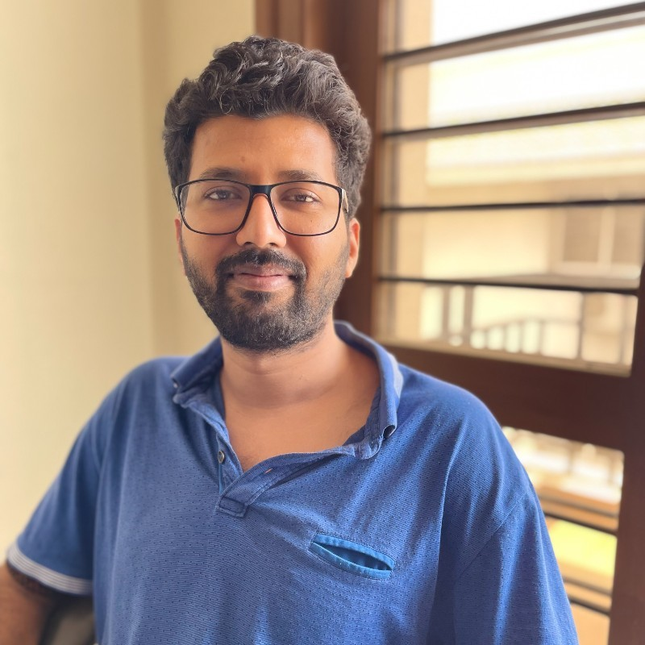
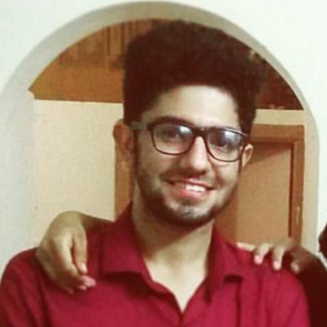
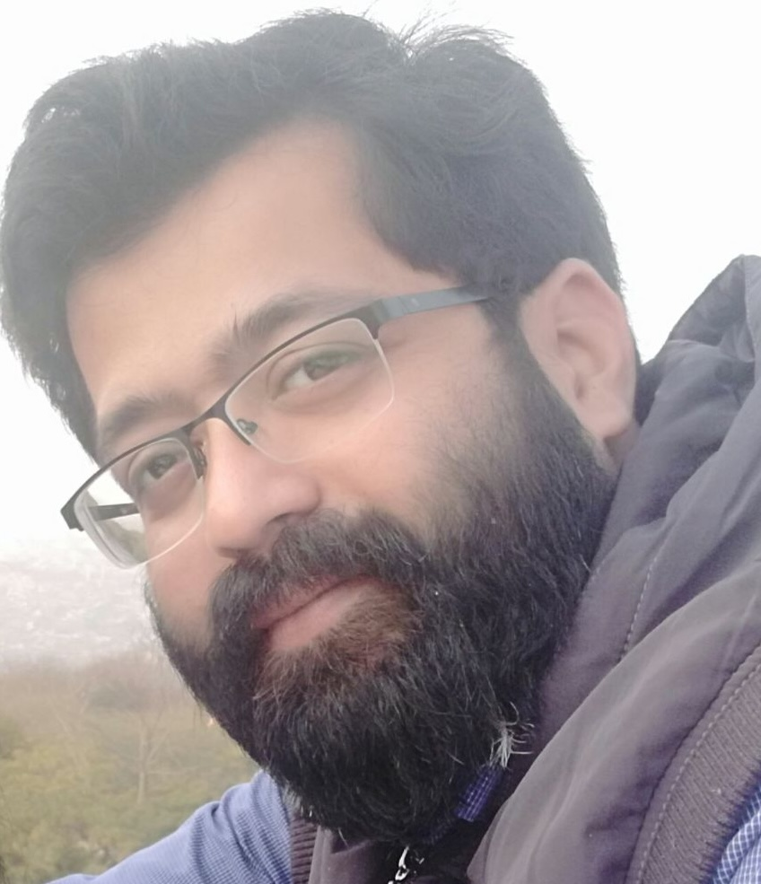
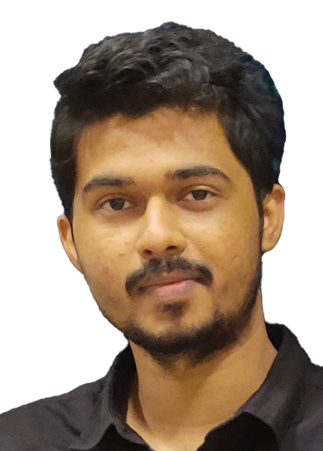
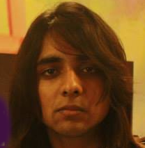

  <h1>Artigenz-Coder-DS-6.7B</h1>
  
Artigenz-Coder-DS-6.7B is a compact <strong>13GB</strong> LLM for code generation with 7B parameters. 🌟

<h2 style="margin-left: 10%; margin-right: 10%; text-align: center;">Team</h2>

  

    
    

      
Nikita Agarwal

      
    

    
AI Researcher

    
ex Data Scientist at Microsoft

    
IIIT - Hyderabad, India

  

  

    
    

      
Vivek Verma

      
      
    

    
Post Doctoral Associate

    
Florida International Univesity

    
202 Citations

  

  

    
    

      
Nalin Abrol

      
    

    
ex Software Engineer - Plivo

    
Published in OHBM 2019<a href="">↗</a>

    
IIIT - Hyderabad, India

  

<h3 style="margin-left: 10%; margin-right: 10%; text-align: center;">Special Thanks ❤️</h3>

  

    
    

      
Manish Shrivastava

      
    

    
Assistant Professor

    
Natural Language Processing

    
IIIT - Hyderabad, India

  

  

    
    

      
Manas Kumar Verma

      
      
    

    
CEO

    
Algouniversity YC(S21)

    
IIIT - Hyderabad, India

  

  

    
    

      
Nikhil Tadigoppula

      
    

    
AI Researcher

    
Bronze medalist

    
International Olympiad in

    
Informatics 2013

    
IIIT - Hyderabad, India

  

<h2 style="margin-left: 10%; margin-right: 10%; text-align: center;">What's Next ❓</h2>

The dataset and finetuing scripts used to train Artigenz-Coder-DS-6.7B will be released soon for the open-source-community to use freely. Larger models are on the roadmap. We hope our contribution enables more people to build LLMs.
